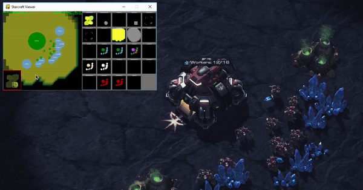

# pysc2-ai
Build your own AI Agent and compete with current DeepMind AIs. Inspired by skjb work on pysc2 older API.




### Setup

```
pip3 install -r requirements.txt
```
### To run on old pysc2 API (version 1.2 and older):
```
python -m pysc2.bin.agent --map Simple64 --agent simple_agent.SimpleAgent --agent_race terran
```

### To run on the latest pysc2 API:
```
python simple_agent.py
```


```
(base) C:\Users\Public\Documents\PYSC2>python -m pysc2.bin.agent --map Simple64 --agent simple_agent.SimpleAgent --agent_race terran
pygame 1.9.4
Hello from the pygame community. https://www.pygame.org/contribute.html
I0324 06:18:55.526213  4512 sc_process.py:110] Launching SC2: C:/Program Files (x86)/StarCraft II\Versions/Base72282\SC2_x64.exe -listen 127.0.0.1 -port 24564 -dataDir C:/Program Files (x86)/StarCraft II\ -tempDir D:\Users\anvil\AppData\Local\Temp\1\sc-m9_l18o4\ -displayMode 0 -windowwidth 640 -windowheight 480 -windowx 50 -windowy 50
I0324 06:18:55.531211  4512 remote_controller.py:163] Connecting to: ws://127.0.0.1:24564/sc2api, attempt: 0, running: True
I0324 06:18:57.537206  4512 remote_controller.py:163] Connecting to: ws://127.0.0.1:24564/sc2api, attempt: 1, running: True
I0324 06:18:59.538694  4512 remote_controller.py:163] Connecting to: ws://127.0.0.1:24564/sc2api, attempt: 2, running: True
I0324 06:19:08.478753  4512 sc2_env.py:322] Environment is ready on map: Simple64
I0324 06:19:08.478753  4512 sc2_env.py:462] Starting episode: 1
[...]

```


#### Also see:
[environment var obs official repo](https://github.com/deepmind/pysc2/blob/master/docs/environment.md#minimap) and
[training smart agents jan 2018](http://chris-chris.ai/2017/11/06/pysc2-tutorial2/).
